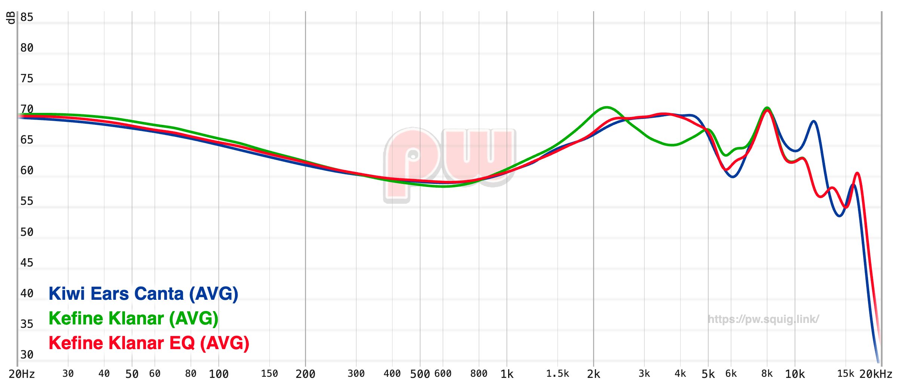

## Kefine Klanars EQ settings

Since I like the sound signature of my Kiwiears Canta, I just went [here](https://pw.squig.link/?share=Kefine_Klanar,Kiwi_Ears_Canta) and adjusted the Klanar's until it resembled it a bit and then made small changes until it sounded nice to me and got this result:

```
Preamp: -5.0 dB
Filter 1: ON PK Fc 63 Hz Gain -0.8 dB Q 0.500
Filter 2: ON PK Fc 580 Hz Gain 0.9 dB Q 1.200
Filter 3: ON PK Fc 1100 Hz Gain -0.7 dB Q 2.000
Filter 4: ON PK Fc 2100 Hz Gain -4.3 dB Q 2.000
Filter 5: ON PK Fc 3700 Hz Gain 6.7 dB Q 1.500
Filter 6: ON PK Fc 5600 Hz Gain -4.4 dB Q 2.000
Filter 7: OFF PK Fc 12000 Hz Gain 0.0 dB Q 2.000
Filter 8: OFF PK Fc 15000 Hz Gain 0.0 dB Q 0.700
Filter 9: OFF PK Fc 0 Hz Gain 0.0 dB Q 0.000
Filter 10: OFF PK Fc 0 Hz Gain 0.0 dB Q 0.000
```



