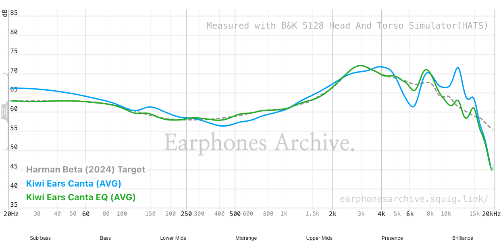

## Kiwi ears Canta EQ settings

I just did some AutoEQ here: https://earphonesarchive.squig.link/?share=Harman_Beta_(2024)_Target,Kiwi_Ears_Canta

And got this result:

```
Preamp: -4.6 dB
Filter 1: ON PK Fc 25 Hz Gain -3.4 dB Q 0.600
Filter 2: ON PK Fc 110 Hz Gain 0.7 dB Q 2.000
Filter 3: ON PK Fc 170 Hz Gain -2.4 dB Q 1.800
Filter 4: ON PK Fc 540 Hz Gain 2.3 dB Q 1.000
Filter 5: ON PK Fc 1700 Hz Gain -1.9 dB Q 1.400
Filter 6: ON PK Fc 3000 Hz Gain 3.2 dB Q 2.000
Filter 7: ON PK Fc 4300 Hz Gain -5.1 dB Q 1.800
Filter 8: ON PK Fc 5900 Hz Gain 6.9 dB Q 2.000
Filter 9: ON PK Fc 12000 Hz Gain -8.9 dB Q 2.000
Filter 10: OFF PK Fc 0 Hz Gain 0.0 dB Q 0.000
```



