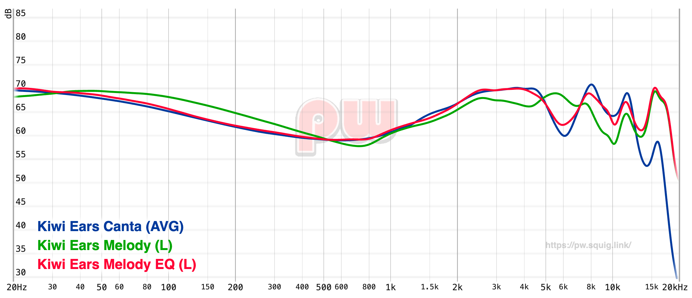

## Kiwiears Melody EQ settings

Since I like the sound signature of my Kiwiears Canta, I just went [here](https://pw.squig.link/?share=Kiwi_Ears_Canta,Kiwi_Ears_Melody) and adjusted the Melody's until it resembled it a bit and then made small changes until it sounded nice to me and got this result:

```
Preamp: -5.5 dB
Filter 1: ON PK Fc 22 Hz Gain 2.0 dB Q 1.900
Filter 2: ON PK Fc 150 Hz Gain -3.0 dB Q 0.500
Filter 3: ON PK Fc 700 Hz Gain 1.7 dB Q 2.000
Filter 4: ON PK Fc 4300 Hz Gain 4.7 dB Q 2.000
Filter 5: ON PK Fc 4500 Hz Gain -2.1 dB Q 0.700
Filter 6: ON PK Fc 5100 Hz Gain 4.8 dB Q 0.500
Filter 7: ON PK Fc 5800 Hz Gain -12.0 dB Q 2.000
Filter 8: ON PK Fc 8900 Hz Gain 5.3 dB Q 2.000
Filter 9: OFF PK Fc 0 Hz Gain 0.0 dB Q 0.000
Filter 10: OFF PK Fc 0 Hz Gain 0.0 dB Q 0.000
```



