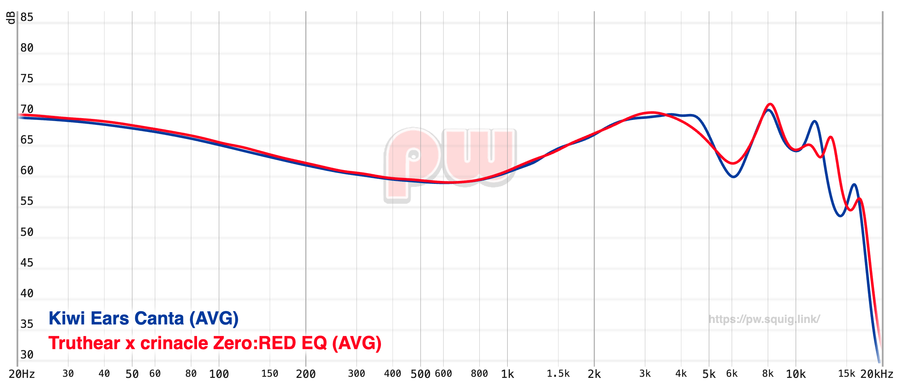

## Truthear Zero RED EQ settings

Since I like the sound signature of my Kiwiears Canta, I just went [here](https://pw.squig.link/?share=Kiwi_Ears_Canta,Truthear_x_crinacle_Zero_RED) and adjusted the RED's until it resembled it a bit and then made small changes until it sounded nice to me and got this result:

```
Preamp: -8.0 dB
Filter 1: ON PK Fc 20 Hz Gain 2.0 dB Q 2.000
Filter 2: ON PK Fc 41 Hz Gain 3.5 dB Q 0.500
Filter 3: ON PK Fc 50 Hz Gain -0.9 dB Q 0.900
Filter 4: ON PK Fc 160 Hz Gain 1.9 dB Q 0.900
Filter 5: ON PK Fc 370 Hz Gain -0.7 dB Q 1.800
Filter 6: ON PK Fc 690 Hz Gain -1.5 dB Q 0.800
Filter 7: ON PK Fc 2100 Hz Gain 0.7 dB Q 1.500
Filter 8: ON PK Fc 6100 Hz Gain -5.7 dB Q 2.000
Filter 9: ON PK Fc 7900 Hz Gain 3.6 dB Q 0.700
Filter 10: ON PK Fc 11000 Hz Gain 8.0 dB Q 2.000
```



